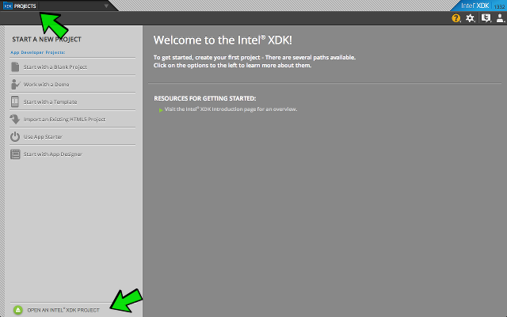
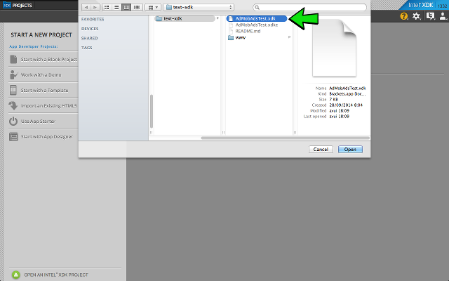
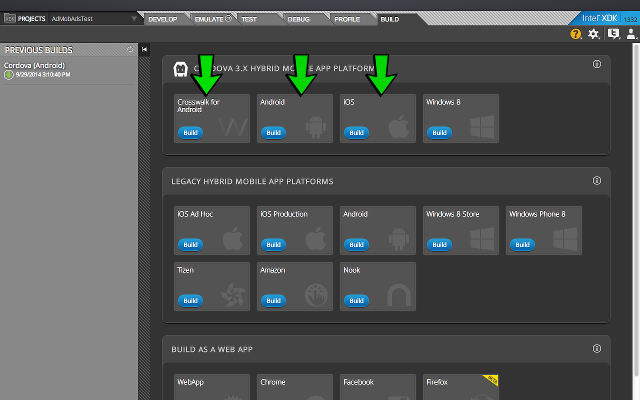

# Instructions to test XDK AdMob plugin:

- [Download](https://github.com/appfeel/admob-google-xdk/archive/master.zip) this project (or clone it with `git clone https://github.com/appfeel/admob-google-xdk.git`)
- Open Intel XDK platform
- Go to PROJECTS tab and click on OPEN AN INTEL XDK PROJECT

- Select `AdmobAdsTest.xdk` from the donloaded folder

- Go to BUILD tab and build the app in the desired platform

- Run it in a real device or emulator

Please note that it will not work in XDK emulator (until support to cordova plugins will be ready)